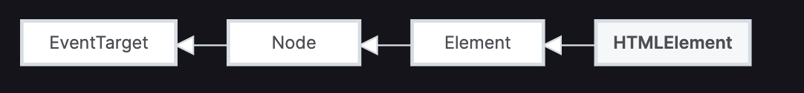

# [Responsive Web Design Certification](https://www.freecodecamp.org/learn/responsive-web-design/)

## HTML Elements 

HTML is similar to ***Lego***. It defines the ***structure*** of web content. 



[HTMLElement - Web APIs | MDN (mozilla.org)](https://developer.mozilla.org/en-US/docs/Web/API/HTMLElement)

[HTML Elements | Web Developer Network | Nebraska (unl.edu)](https://wdn.unl.edu/documentation/5.0/html-elements)

[HTML: HyperText Markup Language | MDN (mozilla.org)](https://developer.mozilla.org/en-US/docs/Web/HTML)

- doctype: tell the browser which HTML version you are using (for example, the following is HTML5)

  - ```html
    <!DOCTYPE html>
    <html>
      <head>
        <meta />
      </head>
      
      <body>
        <div>
        </div>
      </body>
      
    </html>
    ```

- **Metadata** elements, such as `link`, `meta`, `title`, and `style`, typically go inside the `head` element.
- Any markup with the **content** of the page (what displays for a user) would go into the `body` tag.
- `<main></main>`  : 主要内容
  - https://developer.mozilla.org/en-US/docs/Web/HTML/Element/main
  - https://www.freecodecamp.org/learn/responsive-web-design/basic-html-and-html5/introduction-to-html5-elements
- `<div>` : division element, is a general purpose container for other elements.
  - https://developer.mozilla.org/en-US/docs/Web/HTML/Element/div
- ``
- `<a href=></a>`
  - `target="_blank"` 
  - internal link: **heading** or **id** by `#xxx` (what if `#` only?)
  - external link 
- list 
  - unordered `<ul></ul>` followed by `<li></li>`
  - ordered `<ol></ol>` followed by `<li></li>`
- form 
  - `<form></form>` and elements within it 
    - and `action` attribute in `<form>` , it should be **URL** (get, post)
  - `<input type="text">` and `placeholder` attribute 
    - what if an `<input>` not within a `<form>` ???? it will do nothing. 
    - required attribute `<input type="text" required>`
  - `<button type="sunmit"></button>`
  - Radio button 
    - `<label></label>` and `<input type="radio">`
    - two ways, but `for` attribute in `<label>` is best practices. `for` should be linked to an element by `id`
    - `name` attribute is to create a radio button **group**. 
    - https://developer.mozilla.org/en-US/docs/Web/HTML/Element/input/radio
  - Checkbox 
    - similar to radio button 
    - https://developer.mozilla.org/en-US/docs/Web/HTML/Element/input/checkbox
  - `value` attributes for all **input types** 
    - https://developer.mozilla.org/en-US/docs/Web/HTML/Element/input#attr-value
    - The `value` attribute is always optional, though should be considered mandatory for `checkbox`, `radio`, and `hidden`.
    - 可以想一下为什么
  - `checked` attribute for `checkbox`, `radio` ... 

## Basic CSS 

[CSS Object Model (CSSOM) - Web APIs | MDN (mozilla.org)](https://developer.mozilla.org/en-US/docs/Web/API/CSS_Object_Model)

- `style` property in elements 
  - `<h2 style="color: blue;">CatPhotoApp</h2>`
  - https://developer.mozilla.org/en-US/docs/Web/API/HTMLElement/style
- 